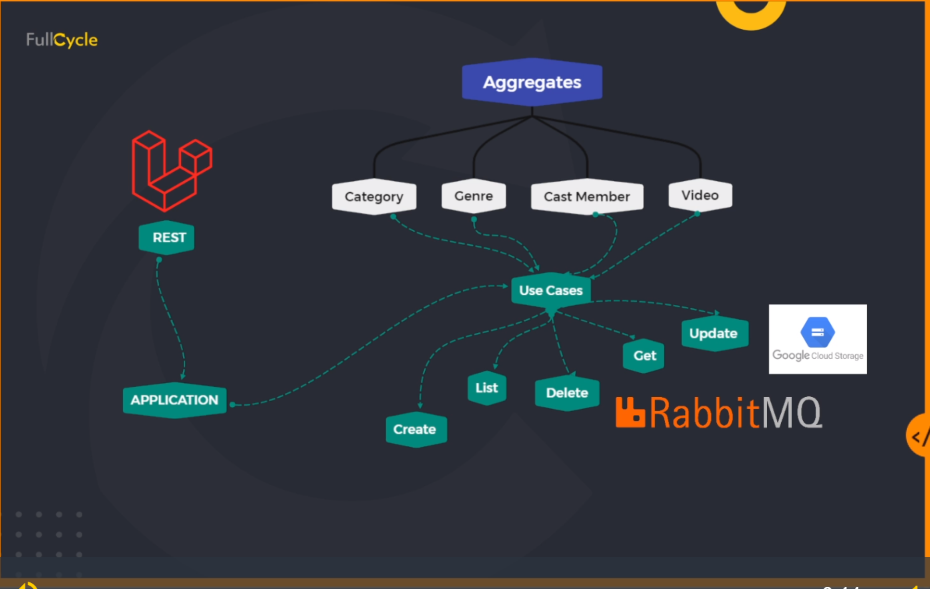
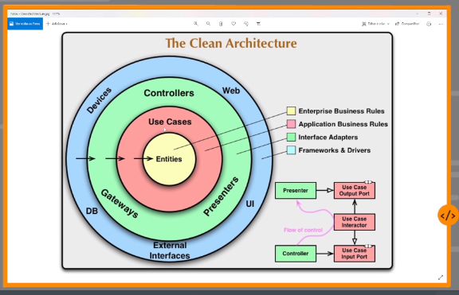
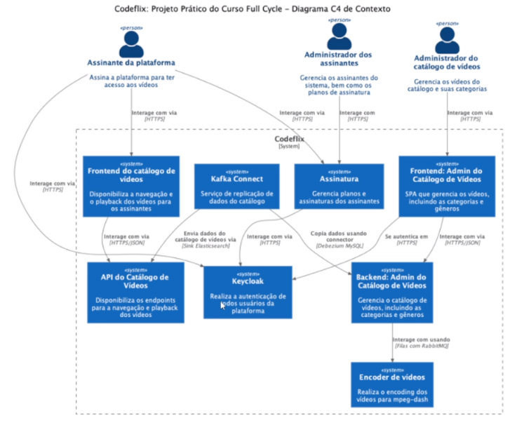

# About

The purpose of this project is create a service about Video's catalog, using Clean Architecture, TDD, DDD, SOLID, and others patterns, and following the course on [FullCycle][fullcycle] school.

The image below shows how this project was built.

### Clean Architecture

### C4 Diagram

This project is one part (service) of a project called "Codeflix". A project based on netflix and using a strong architecture, with microservices, message streaming, authentication with keycloak and others technologies as seen below.

# License
This repository is open-sourced software licensed under the [MIT license][mit-site].

[fullcycle]: https://fullcycle.com.br/
[mit-site]: https://opensource.org/license/mit/
